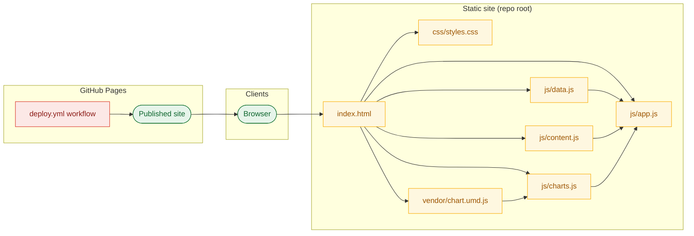
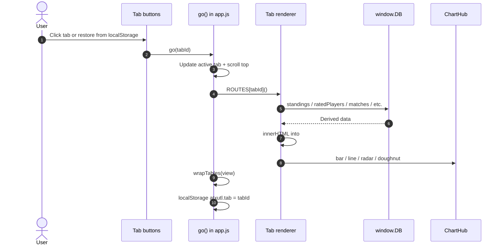
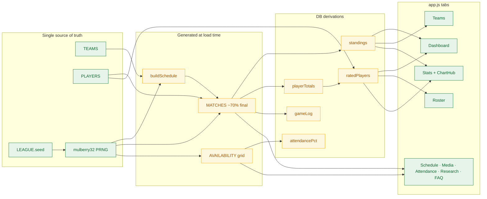
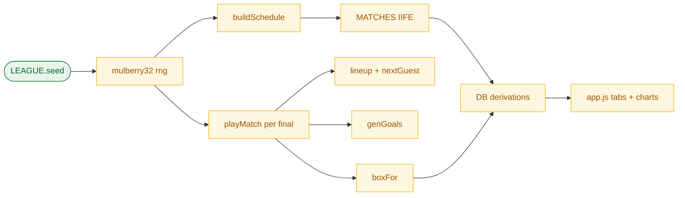

# ATX UTL season dashboard — technical deep dive

Developer reference for the zero-build static season dashboard: architecture, data model, core algorithms (§1–§12), tab routing, theming, and GitHub Pages deployment.

| Attribute | Details |
|-----------|---------|
| Audience | Developers |
| Scope | Full technical reference: architecture, module layout, data model, **core algorithms and logic**, client routing, tab features, theming, charts, deployment |
| Last updated | Jul 22, 2026 (algorithms pass) |
| Owner | ATX UTL site maintainers |
| Source repo | [reuhdz/ATX-UTL-League](https://github.com/reuhdz/ATX-UTL-League) |

---

## Architecture

ATX UTL is a **zero-build static web app** — pure HTML, CSS, and vanilla JavaScript with a vendored Chart.js bundle. There is no framework, bundler, or backend. The browser loads `index.html`, which pulls in stylesheet and script modules in a fixed order; `js/app.js` bootstraps theming, tab routing, and all UI renderers. League data and derived statistics live in a single `window.DB` object exported from `js/data.js`; editorial copy lives in `js/content.js`. The site deploys to GitHub Pages via a GitHub Actions workflow that uploads the repo root as a static artifact.

The app replicates and extends the original Angular/PrimeReact POC at [reuhdz/ATX-UTL-POC](https://reuhdz.github.io/ATX-UTL-POC) with a unified data layer, seeded deterministic demo season, richer charts, a Research tab, and deep-water theming.

> **Note — Algorithm hub.** Every derived stat flows from a single `mulberry32` PRNG seeded by `LEAGUE.seed`. The full pipeline — schedule → lineups → scores → box scores → ratings → charts — is documented in **Core algorithms and logic** below.



### Module hierarchy

```mermaid
flowchart TB
    subgraph Repo["ATX-UTL repo"]
        subgraph Shell["index.html"]
            Header[Header + theming controls]
            Tabs[Tab navigation]
            View[#view container]
            Modal[Player profile modal]
        end

        subgraph Styles["css/styles.css"]
            Themes[data-theme dark/light]
            Presets[data-preset aqua/reef/abyss]
            Responsive[Mobile hamburger + table scroll]
        end

        subgraph DataLayer["js/data.js"]
            League[LEAGUE + RATING constants]
            Roster[TEAMS + PLAYERS]
            Generator[Seeded PRNG season]
            DBObj[window.DB derivations]
        end

        subgraph Editorial["js/content.js"]
            RulesFAQ[RULES + FAQ]
            Research[RESEARCH library]
            Media[MEDIA + stat glossaries]
        end

        subgraph Charts["js/charts.js"]
            ChartHub[ChartHub registry]
        end

        subgraph App["js/app.js"]
            Router[ROUTES + go()]
            Renderers[Tab render functions]
            ThemeInit[Theming + localStorage]
            Clicks[Global click delegation]
        end

        Vendor[vendor/chart.umd.js]
    end

    Shell --> Styles
    Shell --> DataLayer
    Shell --> Editorial
    Shell --> Charts
    Shell --> App
    Vendor --> Charts
    DataLayer --> App
    Editorial --> App
    Charts --> App

    classDef decision fill:#E8F0FE,stroke:#1A73E8,color:#0B3D91;
    classDef process fill:#FEF7E0,stroke:#F9AB00,color:#9C5400;
    classDef io fill:#E6F4EA,stroke:#137333,color:#0D652D;
    classDef external fill:#FCE8E6,stroke:#D93025,color:#8C1D18;
    class Shell,Styles,DataLayer,Editorial,Charts,App,Vendor process;
```

---

## Tech stack

| Layer | Technology | Version / notes | Citation |
|-------|------------|-----------------|----------|
| Markup | HTML5 | Single-page shell with tab nav and modal | `index.html` |
| Styling | CSS custom properties | `data-theme` (dark/light), `data-preset` (aqua/reef/abyss) | `css/styles.css` |
| Application logic | Vanilla JavaScript | No build step; globals on `window` | `js/app.js`, `js/data.js` |
| Charts | Chart.js (UMD, vendored) | 4.x — bundled for offline use (no CDN) | `vendor/chart.umd.js` |
| Persistence | `localStorage` | Theme, accent preset, last active tab | `js/app.js` |
| Hosting | GitHub Pages | Actions deploy on push to `main`; `.nojekyll` at repo root | `.github/workflows/deploy.yml` |
| Local preview | Node static server (optional) | `.preview-server.js` — git-ignored | `README.md` |

---

## Module breakdown

| File | Responsibility | Key exports / symbols | Citation |
|------|----------------|----------------------|----------|
| `index.html` | App shell: header, tab list, `#view`, profile modal, footer, script includes | `view`, `tabs`, `profile-modal`, `theme-toggle`, `menu-toggle` | `index.html` |
| `css/styles.css` | Themes, presets, responsive layout, hamburger, table scroll, modal; mobile overflow fixes | `--accent`, `--surface`, `--chart-grid`, etc. | `css/styles.css` |
| `js/data.js` | **Single source of truth**: roster, seeded season, `DB` derivations | `LEAGUE`, `RATING`, `TEAMS`, `PLAYERS`, `DB` | `js/data.js` |
| `js/content.js` | Rules, FAQ, research library, media config, stat glossaries | `RULES`, `FAQ`, `RESEARCH`, `MEDIA`, `PLAYER_STAT_INDEX`, `TEAM_PROFILE_INDEX` | `js/content.js` |
| `js/charts.js` | `ChartHub` wrapper; registry destroys charts on re-render | `ChartHub.bar`, `.line`, `.radar`, `.doughnut`, `.destroy` | `js/charts.js` |
| `js/app.js` | Router, tab renderers, theming, click delegation, modal, `wrapTables()` | `ROUTES`, `go()`, `openProfile()`, render functions | `js/app.js` |
| `vendor/chart.umd.js` | Vendored Chart.js runtime | Global `Chart` | `vendor/chart.umd.js` |
| `.github/workflows/deploy.yml` | CI: upload repo root as Pages artifact | Job `deploy` | `.github/workflows/deploy.yml` |

---

## Client routing and UI surface

Navigation is client-side only. There is no URL router — the active tab is stored in module state and optionally persisted in `localStorage` under `atxutl.tab`. The `go(tab)` function selects a renderer from `ROUTES`, writes HTML into `#view`, wraps wide tables for horizontal scroll, and scrolls to top.



| Tab id | Renderer | Primary data sources | Notable UI |
|--------|----------|---------------------|------------|
| `dashboard` | `renderDashboard()` | `DB.standings()`, `DB.ratedPlayers()`, `DB.finals()`, `DB.upcoming()` | Stat cards, standings ⓘ glossary, top players, fixtures, goals bar chart |
| `teams` | `renderTeams()` | `DB.standings()`, `DB.rosterOf()`, `DB.teamTotals()`, `DB.nextGameFor()` | Team cards, free-agent strip; `teamHighlight` scroll-on-navigate |
| `roster` | `renderRoster()` | `DB.ratedPlayers()` | Sortable/filterable table, rating formula panel |
| `schedule` | `renderSchedule()` | `DB.matches` | Double round-robin by round; final vs upcoming badges |
| `stats` | `renderStats()` | `DB.ratedPlayers()`, `DB.standings()`, `DB.teamTotals()`, glossaries | Spotlight, leader charts, team radar, points progression, stat index |
| `media` | `renderMedia()` | `MEDIA`, `DB.matches` | Featured tile + game-film grid (`MEDIA.filmBase`) |
| `attendance` | `renderAttendance()` | `DB.availability`, `DB.attendancePct()` | Availability grid (In/Maybe/Out), team filter |
| `research` | `renderResearch()` | `RESEARCH` | Categorized studies + safety panel |
| `faq` | `renderFaq()` | `RULES`, `FAQ` | Rules grid + FAQ accordion |

### Global interactions

- **Player profiles:** Any element with `data-player` opens `openProfile(id)` — modal shows rating, totals, skills radar, per-match game log (guest games flagged), availability %.
- **Team navigation:** `data-team` on team pills (not segment filters) sets `teamHighlight` and calls `go('teams')`.
- **Info panes:** `infoIcon()` renders hover/focus ⓘ popovers for standings columns and rating formula.
- **Modal dismiss:** Close button, overlay click, or Escape key; destroys profile chart via `ChartHub.destroy('c-profile')`.

> **Note — UI logic detail.** Global click delegation, `ChartHub` lifecycle, theme re-render, `wrapTables()`, and mobile overflow fixes are covered in **§12 UI and rendering logic** under Core algorithms and logic.

---

## Data model

All league state is defined at page load in `js/data.js`. Static roster and team metadata are hand-authored; match results, box scores, guest appearances, and availability are generated deterministically from `LEAGUE.seed` using a `mulberry32` PRNG. Changing the seed reshuffles the entire demo season.

> **Note — Generation pipeline.** Schedule structure is deterministic without RNG; lineups, scores, box scores, and availability consume the shared `rng` stream in load order — see §1–§6 in Core algorithms and logic.



### Core entities

| Entity | Purpose | Key fields | Relationships |
|--------|---------|------------|---------------|
| `LEAGUE` | Season metadata + PRNG seed | `name`, `venue`, `season`, `seed` (default `20260721`) | Drives all generated data |
| `TEAMS` | Four clubs | `id`, `name`, `emoji`, `color`, `captain` | Roster via `teamId` on players |
| `PLAYERS` | 32 active roster entries (incl. free agents) | `id`, `name`, `teamId` (`fa` = free agent), `level`, `pos`, hidden `skill` 0..1 | Lineups, box scores, availability |
| `MATCHES` | Double round-robin schedule | `id`, `round`, `date`, `home`, `away`, `status`, scores, lineups, `box[]` | ~70% of rounds played at load |
| `AVAILABILITY` | Upcoming league-night responses | `nights[]`, `table[date][playerId]` → `in`\|`maybe`\|`out` | Extends to ≥4 future Sunday nights |

### `DB` derivation API

| Method | Returns | Used by |
|--------|---------|---------|
| `standings()` | Teams sorted by pts, then GD, then GF (W=3, D=1, L=0) | Dashboard, Teams, Stats charts |
| `ratedPlayers()` | Weighted efficiency, normalized 1–10 rating | Dashboard, Roster, Stats, profiles |
| `playerTotals()` | Season box-score sums + match count | Teams, Roster, rating pipeline |
| `teamTotals(teamId)` | Aggregated G/A/S/B/TO for rostered players | Teams, Stats radar |
| `gameLog(playerId)` | Per-match lines with opponent, result, guest flag | Player profile modal |
| `attendancePct(playerId)` | % of nights marked `in` | Attendance tab, profiles, spotlight |
| `finals()` / `upcoming()` | Filtered match lists | Dashboard, Schedule, Media |
| `nextGameFor(teamId)` | First scheduled match for team | Team cards |

> **Note — Implementation detail.** `standings()`, `ratedPlayers()`, `gameLog()`, and `attendancePct()` are pure functions over `MATCHES` and `AVAILABILITY` — see §7–§8 and §11 in Core algorithms and logic.

> **Note — Ratings & season generation.** Full formulas, pseudocode, and gotchas are in **Core algorithms and logic** (§1–§11).

---

## Core algorithms and logic

This section is the authoritative reference for the non-trivial logic in `js/data.js` and `js/app.js`. All randomness shares one PRNG stream — generation order matters for determinism.



| # | Algorithm | Location | One-line summary |
|---|-----------|----------|------------------|
| 1 | Seeded PRNG | `js/data.js` 101–111 | `mulberry32` — same seed ⇒ identical season |
| 2 | Schedule builder | `js/data.js` 122–152 | Double round-robin + greedy round packing |
| 3 | Season assembly | `js/data.js` 201–209 | ~70% of rounds played as `final` |
| 4 | Lineup generation | `js/data.js` 114–119, 155–160 | 82% attendance + FA guest rotation |
| 5 | Match score model | `js/data.js` 162, 187–190 | Skill-differential goals + jitter, clamped 0–8 |
| 6 | Box-score distribution | `js/data.js` 164–182 | Random secondary stats + skill roulette for goals |
| 7 | Player rating | `js/data.js` 23–30, 290–312 | Weighted score, shrinkage, min–max to 1–10 |
| 8 | Standings | `js/data.js` 257–271 | W3/D1/L0 with GD then GF tiebreakers |
| 9 | Team-profile radar | `js/app.js` 430–454 | Six axes, inverted GA/TO, scaled 15–100 |
| 10 | Points progression | `js/app.js` 456–468 | Cumulative pts after each round |
| 11 | gameLog / attendancePct | `js/data.js` 327–352 | Per-player match log + availability % |
| 12 | UI & rendering | `js/app.js`, `js/charts.js`, `css/styles.css` | Clicks, ChartHub, theme re-render, mobile scroll |

### 1. Seeded PRNG (mulberry32)

**Location:** `js/data.js` lines 101–111 (`makeRng`, `rng`, `rint`).

**Formula / pseudocode:**

```
function makeRng(seed):
  a = seed >>> 0
  return function():
    a = (a + 0x6d2b79f5) | 0          // mulberry32 state step
    t = mix(a)                         // imul + xor bit-mixing
    return t / 4294967296              // float in [0, 1)

rng = makeRng(LEAGUE.seed)
rint(min, max) = floor(rng() * (max - min + 1)) + min
```

**Determinism:** A single global `rng` is created once at module load. Schedule packing does not use `rng`; lineups, scores, box scores, and availability consume the stream in a fixed call order. Same `LEAGUE.seed` + same code ⇒ identical `MATCHES`, `AVAILABILITY`, and all derived stats.

**Reshuffle:** Change `LEAGUE.seed` (line 19) and hard-reload the page.

**Why it matters / gotchas:** There is no seed reset mid-load. If you reorder generation (e.g. call `playMatch` before availability), the entire season changes even at the same seed. Do not instantiate multiple PRNGs unless you intentionally want independent streams.

### 2. Schedule builder (`buildSchedule`)

**Location:** `js/data.js` lines 122–152.

**Formula / pseudocode:**

```
ids = TEAMS.map(t => t.id)
pairs = all unique [ids[i], ids[j]] where i < j        // C(4,2) = 6 pairs

for leg in [pairs, pairs with home/away swapped]:       // double round-robin
  remaining = copy(leg)
  while remaining not empty:
    round++
    used = {}
    dayGames = []
    scan remaining; greedily take pairs [h,a] where h,a not in used, max 2 per round
    date = startDate + (round - 1) * 7 days             // Sunday league nights
    emit match { id: r{round}g{gi}, round, date, home, away }
```

**Why it matters / gotchas:** With four teams, each leg has six pairings packed into three rounds of two games (no team plays twice on one Sunday). The second leg reverses home/away. Round numbers increment continuously across both legs — they are not reset per leg. Schedule generation is deterministic and does **not** consume `rng`.

### 3. Season assembly (`MATCHES` IIFE)

**Location:** `js/data.js` lines 201–209.

**Formula / pseudocode:**

```
sched = buildSchedule()
totalRounds = max(m.round for m in sched)
playedThrough = ceil(totalRounds * 0.7)

for each match m in sched:
  if m.round <= playedThrough:
    m.status = 'final'
    merge playMatch(m)   // scores, lineups, box
  else:
    m.status = 'scheduled'
    scores and box empty
```

**Why it matters / gotchas:** The 70% cutoff is by **round number**, not by match count. All games in a played round are final. Upcoming rounds drive the Schedule tab and seed the availability date list. `playMatch` runs eagerly at load for every final — there is no lazy simulation.

### 4. Lineup generation (`lineup` / `nextGuest`)

**Location:** `js/data.js` lines 114–119, 155–160.

**Formula / pseudocode:**

```
FA_POOL = free agents excluding level 'Pro (IR)'
guestIdx = 0   // module-level, persists across all lineups in load order

nextGuest():
  id = FA_POOL[guestIdx++ % FA_POOL.length]
  return PLAYERS.find(p => p.id === id)   // index MUST advance here, not inside find()

lineup(teamId):
  present = rosterOf(teamId).filter(p => rng() < 0.82)
  if present.length < 4: present = full rosterOf(teamId)
  return present.concat(nextGuest())
```

**Why it matters / gotchas:** Each side gets one FA pickup per match, rotating through `FA_POOL` globally (not per team). The ~82% rule models absences; the min-4 fallback prevents tiny lineups from breaking box-score generation. **Bug fix:** An earlier version incremented `guestIdx` inside a `find()` predicate — that re-evaluates the index on every array element and skips guests unpredictably. The index must be read once (`FA_POOL[guestIdx++ % len]`) then looked up.

### 5. Match score model (`genGoals` / `teamStrength`)

**Location:** `js/data.js` lines 162, 187–190.

**Formula / pseudocode:**

```
teamStrength(players) = mean(p.skill for p in players)

genGoals(teamA, teamB):
  raw = 3 + (teamStrength(A) - teamStrength(B)) * 4 + (rng() * 4 - 2)
  return clamp(round(raw), 0, 8)

homeScore = genGoals(homeLineup, awayLineup)
awayScore = genGoals(awayLineup, homeLineup)   // independent jitter draws
```

**Why it matters / gotchas:** Skill differential shifts the expected total by ±4 goals at maximum spread (skill 0 vs 1). Jitter is uniform on [−2, +2] before rounding. Home and away each draw separate random terms — there is no explicit home-field constant. Scores are clamped to [0, 8] after rounding.

### 6. Box-score goal distribution (`boxFor`)

**Location:** `js/data.js` lines 164–182.

**Formula / pseudocode:**

```
for each player p in lineup:
  assists  = rint(0, p.skill > 0.7 ? 3 : 2)
  steals   = rint(0, p.skill > 0.6 ? 4 : 3)
  blocks   = rint(0, 3) if Goalie/Defender else rint(0, 1)
  turnovers = rint(0, 3)
  goals = 0

totalSkill = sum(p.skill) || 1
repeat goalsScored times:
  r = rng() * totalSkill
  walk lineup in order, subtract each p.skill from r
  first p where r <= 0 gets goals++   // roulette-wheel by skill
```

**Why it matters / gotchas:** Secondary stats are drawn independently per player before goals are allocated. Goal assignment is zero-sum within the team — total player goals equals `goalsScored`. Higher-skill players receive more goals on average but a low-skill striker can still score via the walk order. `players.find` inside the goal loop is O(n²) but n is tiny (~6).

### 7. Player rating (`ratedPlayers`)

**Location:** `js/data.js` lines 23–30, 290–312.

**Formula / pseudocode:**

```
score = G*3 + A*2 + S*1.5 + B*2 + TO*(-1.5)     // season totals, turnovers weight is negative

eff = score / (matches + prior)   where prior = 2
perMatch = score / matches        // computed but not used for rating

played = all players with matches > 0
minEff = min(eff), maxEff = max(eff)

rating = 0                                    if matches == 0
         5                                    if minEff == maxEff
         round(1 + (eff - minEff)/(maxEff - minEff) * 9)   else  // maps to 1..10

sort by rating desc, then goals desc
```

**Why the +2 prior exists:** Without shrinkage, `eff = score / matches` makes a player with one exceptional game (e.g. 3 goals in 1 match → eff 9) beat a consistent multi-game contributor. Dividing by `matches + 2` pulls small samples toward zero — a 1-game wonder gets eff 9/3 = 3, not 9. The UI copy in `RATING.describe` states this explicitly.

**Why it matters / gotchas:** Normalization is league-relative — ratings rescale when anyone's `eff` changes. A player who has not appeared has `rating = 0`, not null. Tie on rating breaks by total goals.

### 8. Standings computation (`standings`)

**Location:** `js/data.js` lines 257–271.

**Formula / pseudocode:**

```
for each final match (homeScore, awayScore):
  update W/D/L, GF, GA, played for home and away
  win  → winner +3 pts, loser +0
  draw → both +1 pt
  loss → inverse of win

sort teams by:
  1. pts descending
  2. (GF - GA) descending
  3. GF descending
```

**Why it matters / gotchas:** Only `status === 'final'` matches count. Standings are recomputed on every call — no caching. Tiebreakers match the copy on the Stats stat index.

### 9. Team-profile radar normalization (`renderStats`)

**Location:** `js/app.js` lines 430–454.

**Formula / pseudocode:**

```
axes = [
  Attack     = GF,
  Defense    = -GA,           // invert: fewer conceded → higher raw
  Playmaking = teamTotals.assists,
  Steals     = teamTotals.steals,
  Blocks     = teamTotals.blocks,
  Discipline = -turnovers     // invert: fewer TO → higher raw
]

for each axis i across 4 teams:
  vals = [raw[i] for each team]
  scaled[i](v) = 60                         if min == max
                 round(15 + (v - min)/(max - min) * 85)   else   // range 15..100
```

**Why inversion on GA and turnovers:** Radar charts assume "outward = better." Raw GA and turnovers are penalties — negating them makes the best defensive / disciplined team plot furthest on those spokes.

**Why it matters / gotchas:** Normalization is **per axis across teams**, not per team across axes. The UI label says "0–100" but the code floors at 15 so every team has visible polygon area when values differ. Uses roster-aggregated `teamTotals` for box-score stats but standings `GF/GA` for attack/defense.

### 10. Points progression (`renderStats`)

**Location:** `js/app.js` lines 456–468.

**Formula / pseudocode:**

```
rounds = sorted unique round numbers from finals
running[teamId] = 0
series[teamId] = []

for r in rounds:
  for each final match in round r:
    apply same W3/D1/L0 pts to running[home], running[away]
  append running[teamId] to series[teamId] for all teams

ChartHub.line x=round labels, y=cumulative pts per team
```

**Why it matters / gotchas:** Snapshots are taken *after* all games in a round complete — if a round has two finals, both apply before the point is recorded. Uses league points (standings pts), not goals.

### 11. `gameLog(id)` and `attendancePct(id)`

**Location:** `js/data.js` lines 327–352.

**gameLog pseudocode:**

```
for each final m where m.box contains playerId:
  forTeam = home if playerId in homeLineup else away
  opp = opposing team id
  gf/ga = scores from forTeam's perspective
  guest = (player.teamId == 'fa') OR (forTeam != player.teamId)
  result = W | L | D from gf vs ga
  push { round, date, opp, gf, ga, guest, box stats }
```

**attendancePct pseudocode:**

```
if no availability nights: return null
return round(100 * count(nights where status == 'in') / nights.length)
```

**Why it matters / gotchas:** `guest` is true for all free agents and for rostered players who appear on a different team's lineup (defensive flag). `attendancePct` counts only explicit `'in'` — `maybe` does not contribute. IR players are excluded from the availability table.

### 12. UI and rendering logic

| Mechanism | Behavior | Location | Why it matters / gotchas |
|-----------|----------|----------|--------------------------|
| Global click delegation | `[data-player]` → `openProfile`; `[data-team]` (excluding `.seg-btn`) → `teamHighlight` + `go('teams')` | `js/app.js` 784–793 | Segment filters also carry `data-team` — the `!seg-btn` guard prevents filter clicks from navigating away |
| `ChartHub` registry | `destroy(id)` before every create; reads `--chart-grid` and `--text-muted` at create time | `js/charts.js` 6–98 | Without destroy, tab re-renders leak Chart.js instances. Profile modal destroys `c-profile` on close |
| Theme toggle re-render | On dark/light toggle: `applyTheme()` then `go(currentTab)` | `js/app.js` 809–814 | Charts do not live-update CSS vars. Preset-only changes do *not* re-render charts |
| `wrapTables()` | After each `go()`, wraps `table.tbl` in `div.table-scroll` if not already wrapped | `js/app.js` 43–52, 778 | Idempotent. Also called when profile modal opens for game log table |
| Mobile overflow fix | `body { overflow-x: clip }`; grid/flex children `min-width: 0`; `.table-scroll { max-width: 100% }` | `css/styles.css` 52–62 | Without `min-width: 0`, wide tables force the page wider than the viewport on mobile |

---

## Tab feature reference

### Dashboard

Four headline stat cards (matches played, total goals, top rated, golden torpedo/top scorer), standings panel, top-7 rated list, next/recent fixtures, and a grouped bar chart of goals for vs against by team (`ChartHub.bar('dash-goals')`).

### Teams

One card per team: emoji, captain, rank, W-D-L record, aggregate team stats, clickable mini-roster with level tags and goal counts, next opponent. Free agents listed in a separate panel. Navigating via a team pill flashes and scrolls the matching card.

### Roster

Full table with client-side sort (click column headers) and segmented filter (All / each team / Free agents). Columns: Rating, Name, Team, Level, Pos, G, A, S, B, TO, MP. Rating column includes ⓘ info popover. Footer panel documents the formula and weight chips.

> **Note — Rating column.** Values come from `DB.ratedPlayers()` — weighted box-score sum, ÷ (matches + 2), league min–max to 1–10. See §7 for the full formula and why the +2 prior prevents one-game flukes.

### Schedule

Matches grouped by round in panels. Each round shows Final or Upcoming badge and date. Completed games use `resultRow()` with highlighted winning score.

### Stats

**Player spotlight** — team segment + player dropdown; mini-stats and 5-axis radar (Goals, Assists, Steals, Blocks, Discipline = `max(0, 8 − turnovers)`).

**Charts:** horizontal bar top scorers and steals leaders; doughnut goal share by team; 6-axis team-profile radar min–max normalized 15–100 across teams; line chart of cumulative league points by round.

**Stat index** — glossaries from `PLAYER_STAT_INDEX`, standings columns, rating explanation, team-profile dimensions, chart construction notes.

> **Note — Chart math.** Team-profile radar (§9) inverts GA and turnovers before cross-team min–max scaling to 15–100. Points progression (§10) snapshots cumulative W3/D1/L0 league points after each round — not goals.

### Media

Featured external link tile from `MEDIA.featured`. Game-film grid builds one card per match; href = `MEDIA.filmBase + 'r{round}-{home}-vs-{away}/'` (default base `clips/`). Team filter and search box filter by team id or round/date text.

### Attendance

Summary row per upcoming night with In/Maybe/Out counts. Full grid: players × nights + Avail% column. Team filter mirrors Roster. Status pills: In (green), Maybe (amber), Out (red).

### Research

Intro paragraph plus categorized study cards (UTL background, UWR physiology, apnea training) with type, year, source, external URL, takeaway. Safety bullet list from `RESEARCH.safety`.

### Rules & FAQ

Static rules grid from `RULES` and FAQ accordion from `FAQ` (first item open by default).

---

## Chart system

`ChartHub` centralizes Chart.js construction. Each chart id is registered; `destroy(id)` runs before re-create so tab switches do not leak canvas instances. Base options read `--chart-grid` and `--text-muted` from the document root so charts respect theme changes. Re-applying theme after toggle re-invokes the current tab renderer to refresh chart colors.

> **Note — Lifecycle.** See §12 — `ChartHub.destroy` on every create, theme toggle calls `go(currentTab)` to rebuild charts with fresh CSS var reads. Preset-only changes update accent chips but do not automatically re-render chart canvases.

| Method | Chart type | Used on |
|--------|------------|---------|
| `ChartHub.bar` | Bar (optional `indexAxis: 'y'`) | Dashboard goals, Stats scorers/steals |
| `ChartHub.line` | Line | Stats points progression |
| `ChartHub.radar` | Radar | Stats team profile, player spotlight, profile modal |
| `ChartHub.doughnut` | Doughnut (`cutout: 62%`) | Stats goal share |

---

## Configuration and theming

| Key / attribute | Type | Default | Storage | Consumed by |
|-----------------|------|---------|---------|-------------|
| `LEAGUE.seed` | number | `20260721` | `js/data.js` source | PRNG — change to reshuffle season |
| `RATING.weights` | object | goals 3, assists 2, steals 1.5, blocks 2, turnovers −1.5 | `js/data.js` | `DB.ratedPlayers()` |
| `RATING.prior` | number | `2` | `js/data.js` | Rating denominator shrinkage |
| `MEDIA.filmBase` | string | `clips/` | `js/content.js` | Media tab game-film links |
| `data-theme` | `dark` \| `light` | `dark` | `localStorage` `atxutl.theme` | `css/styles.css`, `applyTheme()` |
| `data-preset` | `aqua` \| `reef` \| `abyss` | `aqua` | `localStorage` `atxutl.preset` | Accent CSS vars on `:root` |
| Last tab | string | `dashboard` | `localStorage` `atxutl.tab` | `go()` on boot |

### Responsive layout

| Breakpoint | Behavior |
|------------|----------|
| ≤860px | Two-column grids collapse to one column; stat cards 2-wide; media grid 2-wide |
| ≤760px | Preset picker hidden; hamburger toggles `.main-tabs.open` vertical dropdown; tabs full-width |
| ≤640px | Tighter table padding; modal nearly full viewport; mini-stats 3-column |
| ≤400px | Stat cards single column; attendance summary single column |
| Global | `wrapTables()` wraps `table.tbl` in `.table-scroll`; `body { overflow-x: clip }`; grid/flex children `min-width: 0` |

> **Note — Layout gotcha.** `wrapTables()` runs on every `go()` call; CSS `min-width: 0` on grid/flex children prevents intrinsic-width blowout — see §12 UI and rendering logic.

---

## Deployment

```mermaid
flowchart LR
    Push([Push to main]) --> Checkout[actions/checkout@v4]
    Checkout --> Configure[configure-pages@v5]
    Configure --> Upload[upload-pages-artifact@v3]
    Upload --> Deploy[actions/deploy-pages@v4]
    Deploy --> Live([GitHub Pages URL])

    classDef decision fill:#E8F0FE,stroke:#1A73E8,color:#0B3D91;
    classDef process fill:#FEF7E0,stroke:#F9AB00,color:#9C5400;
    classDef io fill:#E6F4EA,stroke:#137333,color:#0D652D;
    classDef external fill:#FCE8E6,stroke:#D93025,color:#8C1D18;
    class Push,Live io;
    class Checkout,Configure,Upload,Deploy process;
```

| Environment | Where it runs | Trigger | Notes |
|-------------|---------------|---------|-------|
| Production | GitHub Pages | Push to `main` or `workflow_dispatch` | Enable Pages source: GitHub Actions. Artifact path is repo root (`path: .`) |
| Local | File system or static server | Manual | Open `index.html`, or `node .preview-server.js` → `http://localhost:4173` |

All asset paths are relative, so the site works as a project page (`username.github.io/repo/`) or custom domain. `.nojekyll` prevents Jekyll processing. No secrets or environment variables are required for deploy.

---

## Local development

1. Clone or open the repo.
2. **Option A:** double-click `index.html` (file:// works for most tabs; some browsers restrict `localStorage` on file URLs).
3. **Option B:** run `node .preview-server.js` and open port 4173.
4. Edit `js/data.js` for roster/seed/rating weights; edit `js/content.js` for copy and media base URL.
5. Change `LEAGUE.seed` and hard-reload to verify deterministic regeneration.

---

## Extension points

| Goal | Where to change |
|------|-----------------|
| Add a player or team | `PLAYERS` / `TEAMS` in `js/data.js` |
| Replace demo season with real results | Replace generated `MATCHES` block with static JSON or fetch; keep `DB` derivations |
| New tab | Add renderer in `app.js`, register in `ROUTES`, add button in `index.html` |
| Real game film | Set `MEDIA.filmBase` and add folders matching `r{n}-{home}-vs-{away}/` |
| New chart | Add canvas id in renderer, call `ChartHub` method; ensure `destroy` on tab leave if needed |
| Fourth accent preset | Add `:root[data-preset="…"]` block in CSS + chip button in header |

---

## Failure modes and recovery

| Failure mode | Symptom | Recovery |
|--------------|---------|----------|
| Chart canvas leak | Memory growth / blank charts after many tab switches | `ChartHub.destroy` runs per id before recreate; profile modal destroys `c-profile` on close |
| Broken game-film links | 404 on Media tile click | Create `clips/` folders in repo or point `MEDIA.filmBase` at valid URL |
| Stale tab after theme toggle | Charts use old colors | Theme toggle re-calls `go(currentTab)` to re-render |
| Pages not updating | Old site after push | Confirm Pages source is GitHub Actions; check workflow run |
| Wide table overflow on mobile | Horizontal page scroll | `wrapTables()` after each render; CSS `min-width: 0` on grid children |

---

## Observability

Static client-only app — no server logs, metrics, or traces. Debug with browser DevTools: inspect `window.DB`, `window.ChartHub.registry`, and `localStorage` keys (`atxutl.*`). GitHub Actions workflow logs cover deploy failures.

---

## Items to review

1. **Venue mismatch** — `LEAGUE.venue` and the footer use *Deepend Fitness* (`js/data.js`), while the FAQ entry "Where does ATX UTL play?" says *Eans Aquatic Center* (`js/content.js`). Pick one canonical venue and align both files.
2. **Owner field** — metadata uses "ATX UTL site maintainers"; update if you want a named owner.
3. **Published URL** — not in the repo; add to the deployment section once GitHub Pages is live.

---

## Sources consulted

- `index.html` (lines 1–66) — app shell, script load order, DOM structure
- `js/data.js` (lines 1–356) — LEAGUE, RATING, TEAMS, PLAYERS, PRNG, `buildSchedule`, `lineup`, `boxFor`, `playMatch`, MATCHES IIFE, AVAILABILITY, `standings`, `ratedPlayers`, `gameLog`, `attendancePct`
- `js/app.js` (lines 1–831) — `wrapTables`, tab renderers, team-profile radar (430–454), points progression (456–468), router, global click delegation, theme re-render
- `js/content.js` (lines 1–268) — RULES, FAQ, RESEARCH, MEDIA, stat glossaries
- `js/charts.js` (lines 1–102) — ChartHub registry, destroy-before-create, CSS var theming
- `css/styles.css` (lines 1–491) — themes, presets, responsive breakpoints, `min-width: 0`, `overflow-x: clip`
- `.github/workflows/deploy.yml` (lines 1–41) — GitHub Pages CI
- `README.md` (lines 1–140) — quick start, tab summary, deploy notes
